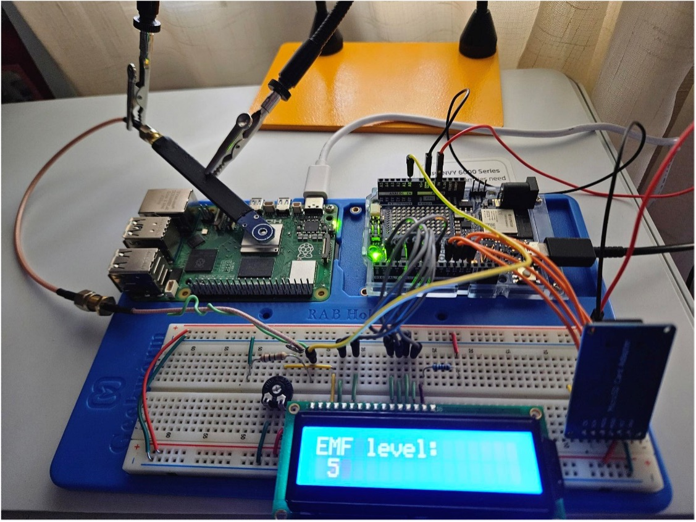
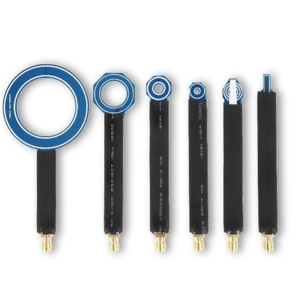
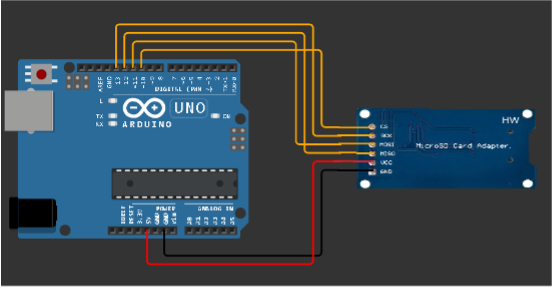
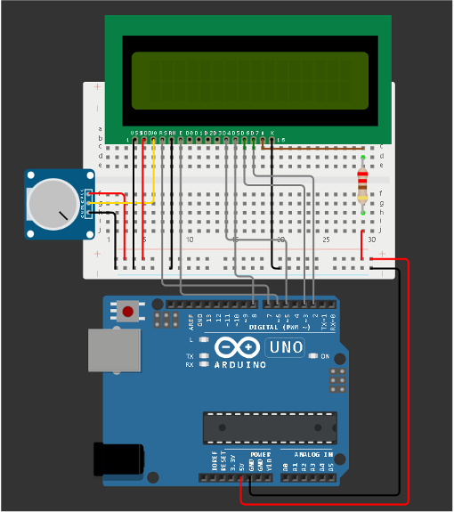
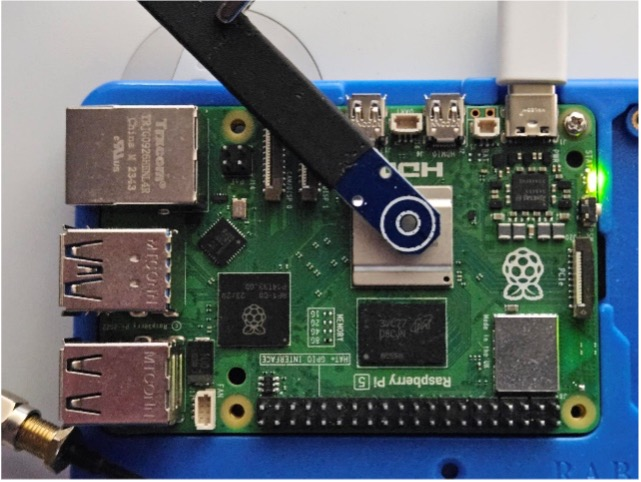

# 3 EM-SENSE Prototyping for Electromagnetic Data Acquisition
The development of EM-SENSE, a prototype for electromagnetic (EM) data acquisition, is central to our research. This device has been specifically designed to capture EM signals generated by computing systems during the execution of various software types. Utilizing the Arduino UNO R4 WiFi platform as the foundational component, EM-SENSE operates as an adaptable and efficient tool for real-time monitoring and remote control of EM emissions in computing environments. This section details the prototype’s hardware composition and configuration process, which are critical for achieving the high sensitivity and precision required for our study. Figure 1 shows an image of the complete setup of EM-SENSE, in which each component can be seen and is described in further detail below.

Figure 1: Overview of the EM-SENSE setup, displaying each component included in the gadget configuration

# 3.1 Hardware Configuration
The Arduino UNO R4 WiFi board is the core processing unit of EM-SENSE due to its versatility and performance capabilities, chosen for its processing power and wireless capabilities (shown in Figure 2a). This hardware is equipped with the Renesas RA4M1 32-bit microcontroller (ARM Cortex M4 architecture), this board operates at a frequency of 48 MHz and offers ample memory resources (32 kB of SRAM and 256 kB of flash). The board supports multiple communication protocols, including UART, I2C, and SPI, facilitating flexible connectivity with peripheral components (see Figure 2b.) WiFi and Bluetooth modules (ESP32-S3) enabling wireless monitoring and remote system control via the Arduino IoT Cloud platform are included. 
The EM-SENSE prototype integrates an SD card module (in Figure 2c) and a 16x2 LCD display module (LCM1602C) for autonomous data storage and real-time signal visualization (shown in Figure 2d). The SD module enables data recording on microSDHC cards, ensuring a high capacity (up to 32 GB) for prolonged testing sessions. 
The LCD display provides instant feedback on detected signal intensity, enabling the identification of potential anomalies during measurement without requiring external interfacing. LCD Screen displays real-time relevant information about the system. On one hand, it shows the results of the preliminary check on the SD card reader module, confirming that there are no access issues. On the other hand, it provides real-time data obtained from the system, allowing us to detect any potential errors, such as zero-value measurements.
Below, we outline the different messages that may appear on the LCD screen:

Figure 2: (a) Pinout diagram of the Arduino UNO R4 WiFi, displaying the layout and functionalities of each pin, essential for the configuration of the EMSENSE prototype, (b) Arduino UNO R4 WiFi board, (c) SPI SD card module and (d) LCD display.

# 3.2 Near-Field Probe Design and Placement
To achieve optimal sensitivity for detecting low-intensity EM signals, a near-field probe (Figure 3) was incorporated into the EM-SENSE design. The probe, replacing a conventional wire antenna, is critical for isolating and capturing low-level emissions, which are characteristic of computing environments. This near-field probe has been strategically positioned relative to the central processing unit (CPU) of the target system, based on a placement study that maximized signal quality by reducing noise and interference. This configuration allows for precise EM measurement in proximity to potential sources of EM variation, such as processor and memory components, which may reveal patterns related to specific software activities, including malware behavior.

 
Figure 3: Near-field probes.

# 3.3 Physical Stabilization, Data Processing and Storage
The EM-SENSE prototype utilizes a protoboard for stable component arrangement and flexible circuit modifications. This setup allows the rapid reconfiguration of elements, such as the LCD display and SD module, without permanent soldering, facilitating adjustments during the testing phase. The protoboard also supports the physical stabilization of components, essential for minimizing signal disruption caused by movement or electrical instability. To further ensure accurate readings, the system includes safeguards against ambient EM interference, such as grounding strategies and shielding, tailored to the near-field probe’s requirements. 
Data captured by EM-SENSE is stored in real-time on the SD card module, allowing it to be used later to create the dataset. This method ensures the integrity and availability of large datasets without interruption, supporting in-depth investigations of EM emissions over extended periods. The data recorded is primarily intended to capture deviations in EM patterns, which may correlate with specific software-induced activities, particularly those indicative of malware. Through data visualization on the integrated LCD, preliminary trends and anomalies can be assessed immediately, streamlining the identification of relevant signal features during testing.

# 3.4 Summary of Design Adaptations for Research Objectives
Although EM-SENSE is based on a previously established design, substantial modifications have been made to meet the specific objectives of this research. Enhancements in signal sensitivity, data handling, and measurement precision ensure that the prototype meets the stringent requirements for detecting subtle EM variations associated with software execution. The device’s adaptability, facilitated by its modular design and the Arduino platform, makes EM-SENSE a highly suitable tool for controlled EM monitoring, enabling the identification of patterns potentially linked to malicious activity within computing systems.

# 4 Proposed System Design

The proposed low-cost gadget leverages electromagnetic field (EM) measurements to identify behavioral patterns in computing devices. By focusing on processor-level EM emissions, this system provides a tool for monitoring anomalies that may indicate malicious activity. Unlike conventional EM measurement systems, which rely on expensive high-resolution oscilloscopes and probes, this design employs an Arduino UNO R4 WiFi board with custom circuitry. This approach offers significant cost savings and accessibility without compromising the essential signal capture and processing capabilities necessary for effective malware detection through side-channel analysis.

# 4.1 Hardware Architecture
The hardware architecture is based on an Arduino UNO R4 WiFi board. It offers a wide computational power for handling signal acquisition and initial data processing tasks. This microcontroller are sufficient for performing basic filtering and data pre-processing directly on the device, reducing data transfer latency. The integrated WiFi and Bluetooth functionalities facilitate remote monitoring and data transmission to a host computer, enabling convenient control and data access during extended experimental runs.

# 4.2 Signal Acquisition and Amplification
A major innovation in our design is the replacement of traditional cable antennas with a near-field probe, specifically optimized for low-intensity EM emission capture. This probe is placed strategically close to the CPU of the target device (a Raspberry Pi 5) to enhance signal sensitivity and fidelity. The near-field probe, in combination with an amplification circuit based on an operational amplifier, allows the system to detect subtle fluctuations in EM emissions associated with different processing states. The amplification stage is calibrated to balance gain and noise suppression, optimizing the capture of low-amplitude signals indicative of malware-related anomalies without introducing significant distortion.

# 4.3 Data Display and Storage
For real-time monitoring, the system includes a 16x2 LCD display, which provides immediate visual feedback on the intensity of the EM signal and status of the system. This feature allows operators to detect anomalies or errors in situ without relying on external displays. Data storage is managed through an SD card module interfaced with Arduino via the SPI protocol (shown in Figure 4), allowing the storage of large volumes of data (up to 32 GB) directly on the device. This modular data storage approach supports extended data capture sessions and simplifies data handling during post-processing.

 
Figure 4: SD module conexion.

# 4.4 Modular Configuration
The entire system is built on a protoboard, enabling flexible configurations and components. This modularity allows quick adjustments in probe positioning and amplifier tuning, as well as easy integration of additional components if further signal conditioning is required. The configuration maximizes adaptability for a wide range of experimental conditions, making it suitable for testing various types of IoT devices and embedded systems in controlled environments.

In Figure 5, the pin connections between the LCD screen and the Arduino microcontroller are shown. This configuration allows for seamless data visualization on the LCD screen. In addition, a potentiometer is included to adjust the screen brightness, offering flexibility in display readability under various lighting conditions.

 
Figure 5: Pin connections between the LCD screen and the Arduino.

Near-Field Probe: Among the available probes for measurement collection, we selected one that allows us to position the probe as close  to the CPU as possible, covering the largest possible surface area (shown in Figure 6b). This choice maximizes the spatial resolution of the electromagnetic field readings near the CPU.

The detection device probe is connected to the analog input A0 (yellow cable) on the Arduino, through a voltage divider with a 1 MΩ resistor (shown in Figure 6b). This setup enhances the sensitivity of the measurements, enabling a more precise detection of variations in electromagnetic emissions.

In Figure 1, the final setup of the EM-SENSE equipment is illustrated, capturing electromagnetic emissions while executing a software block. This configuration represents the operational scenario used for data collection and assessment of emissions.

All software utilized for data acquisition is systematically documented in the scripts folder in this GitHub repository. Below is a list of the main software components employed:

    Arduino Sketch: Configures and operates the connected devices.
    
    Loop Execution Bash Script: Enables the repetitive execution of the different files to be executed
    
    One-hot-encoding file generator: All the files to convert the data to one-hot-encoding format to be able to run 
    the different AI models are located here.

This setup and documentation collectively ensure that the EM-SENSE system can accurately and reliably detect and analyze electromagnetic emissions, supporting comprehensive data collection for the study of software behavior.

             

Figure 6: (a) Near-field probe capturing EM (b) Probe conections.

